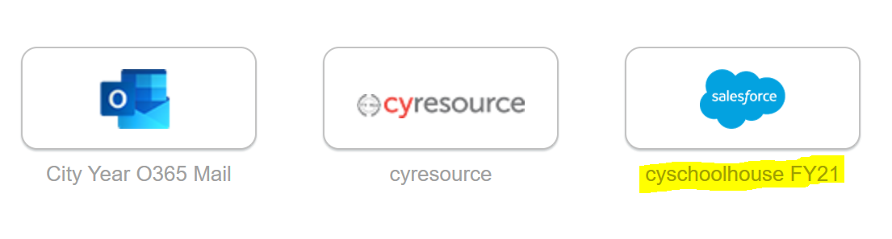
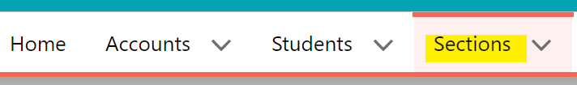
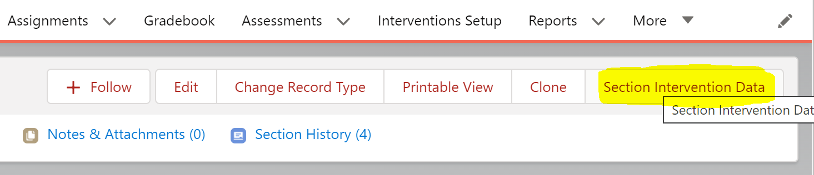
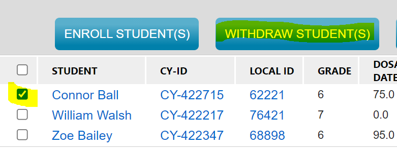
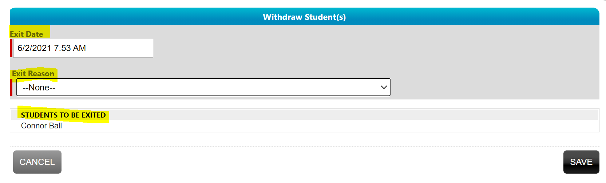
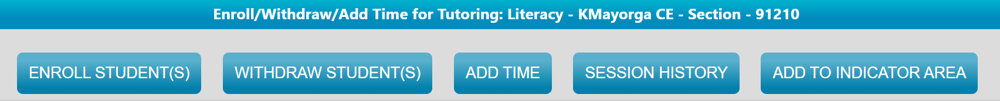
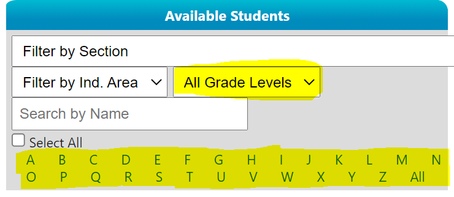
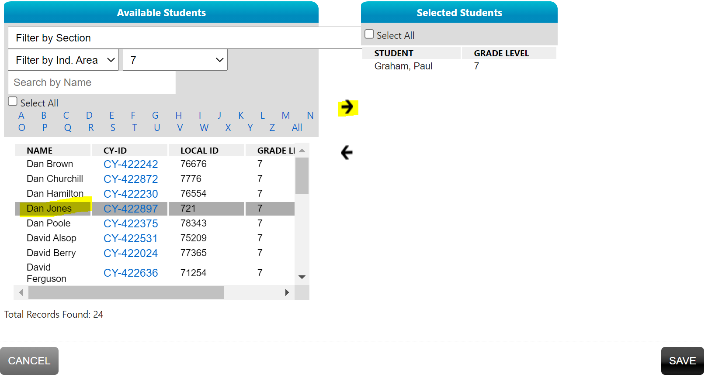

# Caseload Changes on CYSH

Caseload changes via cyschoolhouse will be managed by program managers after Impact Analytics goes through the initial enrollment process. Program managers will then validate and mange any changes needed thereafter. Program managers may create their own process of identifying, validating, and managing changes or may use their focus list workbooks.

### Managing Caseloads Using the Focus List WkBk:

- Sections/columns X-X were created to help with caseload management
- ACMS can use column X to identify students that need to be added or removed from a caseload
- PMs can use column X to keep track of their actions
- Columns X are there to assist

### Validating and Managing Focus List Caseloads

> - New students must meet the focus list criteria:
>   -  Students in 3rd grade – 9th grades
>   - Students that are at risk for falling behind
>   - ***Students that are not on another ACM’s focus list***
> - Removing students from a focus list must have a valid reason:
>   - Student moved classes
>   - Chronic absenteeism
>   - Student left the school

## Add/Removing Students to Sections

1. Go to CYSH by clicking the cyschoolhouse tile in your [Okta homepage](https://cityyear.okta.com/app/UserHome)

2. Click on the 'Setions' tab to locate the section needed

3. On the top right-hand corner, find and select 'Section Intervention Data'

### Withdrawing Students

- Select the student(s) to remove by clicking on the checkbox next to their names. *You may select multiple students at a time*

- Using the ribbon, select 'Withdraw Student(s)

- In the new window, select an ***Exit Date***, if different from today, and and ***Exit Reason***.

- Click 'Save'

### Adding Students

- Using the ribbon, select 'Enroll Student(s)'

- Enter an enrollment date. ***Should be the 1st day the student started recieving services***

  - Students with different enrollment dates will need to be enrolled separately.

- Use the 'All Grade Levels' filter to filter to the student(s)' grade levle

- Then use the 'Alphabet' filter to filter the names to the student(s)' FIRST NAME

- Select your student(s) in the left pane, then use the right arrow on the screen to move them to the right pane.

  - Repeat this step until all student(s) have been selected

- Once all students have been selected and validated, click Save.

